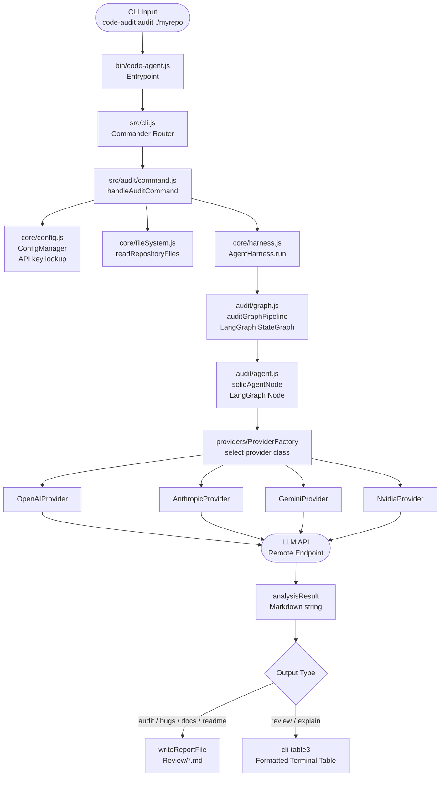

# code-audit-harness

> Multi-agent, multi-provider CLI tool for automated code safety auditing, architectural analysis, and intelligent documentation generation.

---

## Overview

`code-audit-harness` is a Node.js CLI tool that brings LLM-powered code intelligence directly into your terminal. It routes your codebase through purpose-built LangGraph agent pipelines — each one specialised for a different analytical task — and delivers structured Markdown reports or formatted terminal output without leaving your shell.

It supports four major LLM providers out of the box (OpenAI, Anthropic, Google Gemini, NVIDIA NIM), lets you select any model per-run via an interactive TUI dashboard, and stores credentials once in a global config so repeat runs stay friction-free.

**Who it's for:** Individual developers, tech leads, and teams who want fast, repeatable, AI-assisted code reviews, SOLID audits, bug sweeps, and documentation drafts without context-switching to a browser or IDE plugin.

---

## Features

| Command | Description |
|---|---|
| `audit` | Deep SOLID-principles audit across an entire repository. Produces a structured Markdown report covering architectural overview, per-component violations, and refactoring recommendations. |
| `bugs` | Static logic and vulnerability sweep. Identifies bugs, edge-case failures, and unsafe patterns across your codebase. |
| `docs` | Generates a full `ARCHITECTURE.md` — modular blueprints, data-flow documentation, and component relationship maps. |
| `readme` | Drafts a production-ready `README.md` for any repository based on its actual source layout and purpose. |
| `review` | Inline code review for a single file or directory. Outputs a formatted terminal table with analysis metrics. |
| `explain` | Plain-language explanation of what a file or module does — useful for onboarding or unfamiliar codebases. |
| `init` | First-time interactive setup. Selects providers, stores API keys globally under `~/.code-agent/config.json`. |
| _(no args)_ | Launches the interactive **TUI dashboard** — a full-screen terminal UI for selecting provider, model, command, and target path without typing flags. |

---

## Architecture

```
bin/code-agent.js          # Executable entrypoint (shebang → node)
    ↓
src/cli.js                 # Commander.js program — routes subcommands and launches TUI
    ↓
src/<feature>/command.js   # Per-feature handler: reads files, resolves provider/model, writes reports
    ↓
src/core/harness.js        # AgentHarness — selects the correct LangGraph pipeline and invokes it
    ↓
src/<feature>/graph.js     # LangGraph StateGraph — defines nodes, edges, and state annotations
    ↓
src/<feature>/agent.js     # LangGraph node function — calls the provider with the feature prompt
    ↓
src/providers/             # ProviderFactory + OpenAI / Anthropic / Gemini / NVIDIA implementations
    ↓
LLM API                    # Remote model endpoint (OpenAI, Anthropic, Gemini, NVIDIA NIM)
    ↓
Terminal output / Report   # Markdown file written to Review/ or formatted cli-table3 output
```

### Data Flow Diagram



### Key Layers

- **`bin/`** — Thin shebang entrypoint. Imports `src/cli.js` and hands off.
- **`src/cli.js`** — Commander.js program. Defines `init` and the default TUI action. Direct subcommands (`audit`, `bugs`, etc.) live in `bin/code-agent.js`.
- **`src/<feature>/command.js`** — The command handler. Accepts `(filePath, providerName, modelName)`. Loads config for API key, falls back to saved defaults if provider/model are not passed explicitly.
- **`src/core/harness.js`** — `AgentHarness` class. Receives a provider instance and model string, selects the matching LangGraph pipeline, and invokes it with a unified `inputState`.
- **`src/<feature>/graph.js`** — LangGraph `StateGraph` with `repositoryFiles` and `analysisResult` state annotations. Single-node pipelines for focused, deterministic execution.
- **`src/providers/`** — `BaseProvider` abstract class extended by `OpenAIProvider`, `AnthropicProvider`, `GeminiProvider`, and `NvidiaProvider`. Each implements `invoke(messages, model)` and `getModels()`.
- **`src/core/config.js`** — `ConfigManager` persists credentials to `~/.code-agent/config.json`. Loaded on every handler invocation for API key resolution.

---

## Installation

### Prerequisites

- **Node.js >= 18.0.0**
- API key(s) for at least one supported provider

### Steps

```bash
# Clone the repository
git clone https://github.com/your-username/code-audit-harness.git
cd code-audit-harness

# Install dependencies
npm install

# Link globally so the code-audit command is available system-wide
npm link
```

To unlink later:

```bash
npm unlink -g code-audit-harness
```

---

## Setup

Run `init` once to configure your provider credentials:

```bash
code-audit init
```

You will be prompted to:

1. **Select providers** — checkbox list of `openai`, `anthropic`, `gemini`, `nvidia`
2. **Enter API keys** — one masked password prompt per selected provider

Credentials are written to `~/.code-agent/config.json`. The first provider you select becomes the default for direct CLI commands. You can re-run `init` at any time to update keys or add new providers.

```
Initializing Global Multi-Provider Credentials Engine Store...
? Select and enable available model provider endpoints: (Press <space> to select)
 ◉ openai
 ◯ anthropic
 ◉ gemini
 ◯ nvidia

Enter API Secret token authentication key for [OPENAI]: ****************
Enter API Secret token authentication key for [GEMINI]: ****************

✓ Persistent configurations profiles written safely inside .code-agent/config.json.
Setup complete! Run code-audit now to launch your interactive environment.
```

---

## Usage

### Direct CLI Commands

All commands accept a path to a file or directory as their target.

```bash
# SOLID principles audit — writes Review/SOLID_AUDIT.md
code-audit audit ./src

# Bug and logic sweep — writes Review/BUG_REPORT.md
code-audit bugs ./src

# Architecture documentation — writes Review/ARCHITECTURE.md
code-audit docs ./my-project

# README generation — writes Review/README.md
code-audit readme ./my-project

# Inline code review — outputs formatted terminal table
code-audit review ./src/auth/login.js

# Plain-language explanation — outputs formatted terminal table
code-audit explain ./src/core/harness.js
```

Reports are written to a `Review/` directory inside the target path by default. The output directory can be customised via the `outputDir` field in `~/.code-agent/config.json`.

#### Example terminal output (review / explain)

```
┌────────────────────────────────────────────────────────────────────────────────┐
│ Analysis Metric Cluster Output                                                 │
├────────────────────────────────────────────────────────────────────────────────┤
│ ## Code Review Summary                                                         │
│                                                                                │
│ **Overall Quality:** Good                                                      │
│ **Complexity:** Medium                                                         │
│                                                                                │
│ ### Observations                                                               │
│ - Error handling is consistent across all branches                             │
│ - Consider extracting the provider resolution logic into a shared utility      │
│ - Missing input validation on the `filePath` parameter                         │
└────────────────────────────────────────────────────────────────────────────────┘
```

### Interactive TUI Dashboard

Run `code-audit` with no arguments to launch the full-screen terminal dashboard:

```bash
code-audit
```

The TUI presents three selector panels and a path input:

```
┌─────────────────── Solid Agent Harness ────────────────────┐
│  ┌─ Path ──────────────────────────────────────────────┐   │
│  │  ./my-project                                       │   │
│  └─────────────────────────────────────────────────────┘   │
└─────────────────────────────────────────────────────────────┘

┌─ Provider ──────┐   ┌─ Command ───────┐   ┌─ Model ────────────────────┐
│   OPENAI        │   │   audit         │   │   gpt-4o                   │
└─────────────────┘   └─────────────────┘   └────────────────────────────┘

        [Tab] cycle   [←/→] change   [Enter] run   [Esc] quit
```

- **Tab** cycles focus between the four panels
- **← / →** (or Up/Down) cycles options within the focused panel
- **Enter** (while the path input is focused) executes the selected command
- The Model panel dynamically fetches available models from the selected provider's API

Provider and model selection in the TUI are passed directly to the command handler — your saved config default is used only as a fallback when running direct CLI commands.

---

## Supported Providers

| Provider | Default Model | Notes |
|---|---|---|
| **OpenAI** | `gpt-4o` | Full GPT model family. Models fetched live from the OpenAI API. |
| **Anthropic** | `claude-3-5-sonnet-latest` | Claude 3 and Claude 4 model families supported. |
| **Google Gemini** | `gemini-1.5-pro` | Via `@langchain/google-genai`. Requires a Google AI Studio API key. |
| **NVIDIA NIM** | `meta/llama3-70b-instruct` | Uses the OpenAI-compatible NIM endpoint at `integrate.api.nvidia.com/v1`. Supports any model available in your NVIDIA NIM subscription. |

Model lists are fetched live from each provider's API when using the TUI. If the fetch fails, a curated fallback list is used automatically.

---

## Project Structure

```
code-audit-harness/
├── bin/
│   └── code-agent.js          # Global executable entrypoint
├── src/
│   ├── cli.js                 # Commander.js program definition
│   ├── audit/
│   │   ├── agent.js           # LangGraph node — SOLID audit
│   │   ├── command.js         # handleAuditCommand handler
│   │   ├── graph.js           # LangGraph StateGraph pipeline
│   │   └── prompt.js          # System prompt for audit agent
│   ├── bugs/
│   │   ├── agent.js
│   │   ├── command.js         # handleBugsCommand handler
│   │   ├── graph.js
│   │   └── prompt.js
│   ├── docs/
│   │   ├── agent.js
│   │   ├── command.js         # handleDocsCommand handler
│   │   ├── graph.js
│   │   └── prompt.js
│   ├── readme/
│   │   ├── agent.js
│   │   ├── command.js         # handleReadmeCommand handler
│   │   ├── graph.js
│   │   └── prompt.js
│   ├── review/
│   │   ├── agent.js
│   │   ├── command.js         # handleReviewCommand handler
│   │   ├── graph.js
│   │   └── prompt.js
│   ├── explain/
│   │   ├── agent.js
│   │   ├── command.js         # handleExplainCommand handler
│   │   ├── graph.js
│   │   └── prompt.js
│   ├── core/
│   │   ├── config.js          # ConfigManager — credential persistence
│   │   ├── fileSystem.js      # Repository file reader and report writer
│   │   └── harness.js         # AgentHarness — pipeline orchestrator
│   ├── providers/
│   │   ├── baseProvider.js    # Abstract BaseProvider class
│   │   ├── providerFactory.js # ProviderFactory.create(name, config)
│   │   ├── openai.js
│   │   ├── anthropic.js
│   │   ├── gemini.js
│   │   └── nvidia.js
│   └── ui/
│       └── interactive.js     # Blessed TUI dashboard
├── Review/                    # Default output directory for generated reports
├── .env                       # Optional local environment overrides
├── package.json
└── README.md
```

---

## Contributing

Contributions are welcome. Please follow these guidelines:

### Branch Strategy

- `main` — stable release branch. Direct commits are not permitted.
- `v2` — current active development branch. Feature work branches off here.
- `v1` — legacy branch, maintained for reference only.

Create feature branches from `v2`:

```bash
git checkout v2
git checkout -b feature/your-feature-name
```

### Pull Request Guidelines

- Keep PRs focused — one feature or fix per PR
- Include a clear description of what changed and why
- If adding a new provider, follow the `BaseProvider` interface: implement `invoke(messages, model)` and `getModels()`
- If adding a new command, follow the four-file pattern: `agent.js`, `command.js`, `graph.js`, `prompt.js` — and register the handler in `src/core/harness.js` and `src/ui/interactive.js`
- Run a manual smoke test against at least one provider before opening a PR

---

## Known Limitations

- **No streaming output** — all provider calls are single-shot invocations. Large repositories may have a noticeable wait before output appears.
- **Context window limits** — very large codebases may exceed model context windows. The file reader does not currently chunk or summarise input.
- **Model list fetching** — live model list fetching relies on undocumented or informal endpoints for some providers; the fallback static lists may become stale as providers release new models.
- **NVIDIA NIM debug logs** — the NVIDIA provider currently emits `DEBUG` console lines during invocation. This will be removed in a future release.
- **No test suite** — automated testing is not yet configured. Contributions adding a test framework (e.g., Vitest) are welcome.

---

## Roadmap

- [ ] Streaming output support for long-running analyses
- [ ] Input chunking / summarisation for large repositories
- [ ] `edit` command — AI-assisted in-place file editing (scaffold present at `src/edit/`)
- [ ] Remove debug logging from NVIDIA provider
- [ ] Configurable output directory via CLI flag
- [ ] Vitest-based unit and integration test suite
- [ ] CI pipeline (GitHub Actions) for lint and smoke tests

---

## License

[MIT](./LICENSE)
