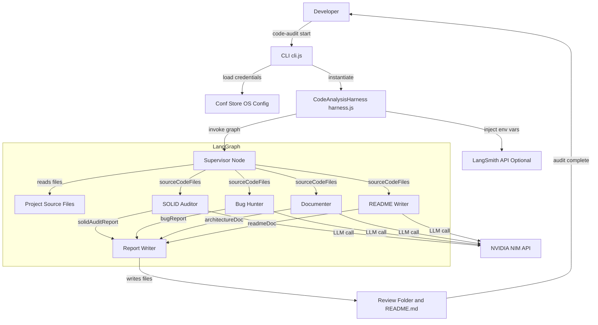
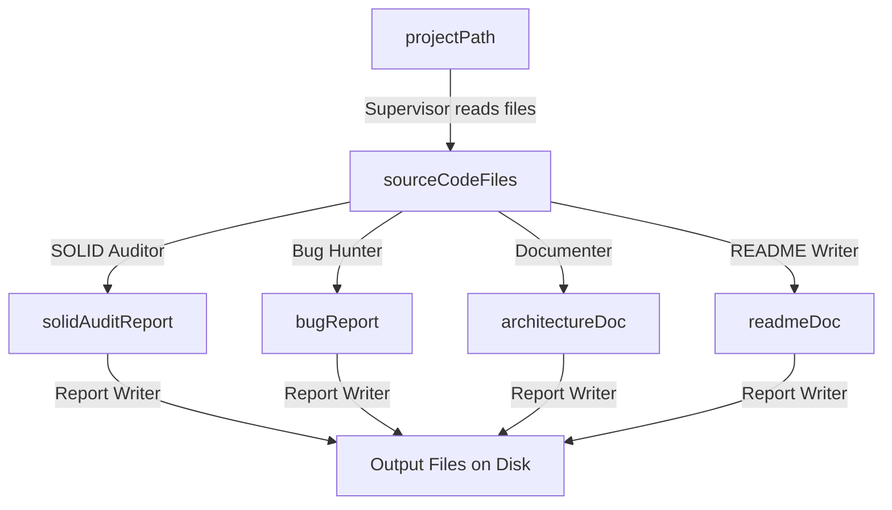

# Code Audit Harness

> A parallel multi-agent CLI platform for deep code analysis — auditing SOLID design principles, hunting logical bugs, generating architecture documentation, and producing professional README files, all in a single command.

---

## Table of Contents

- [Overview](#overview)
- [How It Works](#how-it-works)
- [Architecture Diagram](#architecture-diagram)
- [Features](#features)
- [Tech Stack](#tech-stack)
- [Project Structure](#project-structure)
- [Prerequisites](#prerequisites)
- [Installation](#installation)
- [Configuration](#configuration)
- [Usage](#usage)
- [Output](#output)
- [Agent Reference](#agent-reference)
- [LangSmith Tracing (Optional)](#langsmith-tracing-optional)
- [Contributing](#contributing)
- [License](#license)

---

## Overview

**Code Audit Harness** is an enterprise-grade, multi-agent code analysis tool that spins up a LangGraph-orchestrated pipeline of specialized AI agents against any codebase. Each agent runs a focused task in parallel — SOLID design review, bug detection, architecture documentation, and README generation — then a report writer aggregates everything into structured markdown output files.

The tool is powered by the **NVIDIA NIM API** (accessed through a LangChain OpenAI-compatible wrapper), meaning you get high-quality LLM reasoning tailored for code analysis tasks without needing an OpenAI subscription. Optionally, full execution tracing can be streamed to **LangSmith** for observability and debugging.

Supported languages: **JavaScript**, **TypeScript**, **Python**, **Go**, **Java**.

---

## How It Works

The pipeline follows a strict fan-out → fan-in execution pattern orchestrated by LangGraph:

1. **CLI** parses the command and loads credentials from a secure local config store.
2. **Harness** validates the target directory, optionally injects LangSmith environment variables, then invokes the compiled graph.
3. **Supervisor Node** walks the project directory (respecting `.gitignore` rules), reads all valid source files, and fans out to four specialist agents simultaneously.
4. **Four agents** run in parallel, each receiving the full source code context and returning a structured markdown report segment.
5. **Report Writer** collects all four outputs, clears any existing `Review/` folder, and writes the final report files to disk.

---

## Architecture Diagram



### State Flow



---

## Features

- **Parallel agent execution** — all four analysis agents run concurrently via LangGraph fan-out edges, minimizing total wall-clock time.
- **SOLID principles audit** — per-principle (S/O/L/I/D) PASS/FAIL verdicts backed by code citations and concrete refactoring examples.
- **Logical bug detection** — file-by-file scan with exact line references, code snippets, root-cause explanations, and corrected code.
- **Architecture documentation** — unified system-level overview with module responsibilities, data flows, dependencies, and an auto-generated Mermaid diagram.
- **README generation** — professional, codebase-specific GitHub README with all standard sections populated.
- **`.gitignore`-aware file ingestion** — automatically excludes `node_modules`, build artifacts, and any custom ignore rules.
- **Secure credential storage** — API keys are persisted via `conf` (OS-native config store), never in plain environment files for production use.
- **Optional LangSmith tracing** — full execution metrics streamed to LangSmith when a key is supplied.
- **Rate-limit guard** — 2-second sleep between per-file Bug Hunter calls to stay within NIM API rate limits.
- **Global CLI install** — ships as a `code-audit` binary via the `bin` field in `package.json`.

---

## Tech Stack

| Layer | Technology |
|---|---|
| Runtime | Node.js (ESM, `"type": "module"`) |
| CLI Framework | [Commander.js](https://github.com/tj/commander.js) v12 |
| Agent Orchestration | [LangGraph](https://github.com/langchain-ai/langgraphjs) v0.2 |
| LLM Abstraction | [LangChain](https://github.com/langchain-ai/langchainjs) / `@langchain/openai` v0.3 |
| LLM Backend | [NVIDIA NIM API](https://build.nvidia.com/) (OpenAI-compatible) |
| Recommended Model | `meta/llama-3.1-70b-instruct` |
| Config Storage | [conf](https://github.com/sindresorhus/conf) v12 |
| Gitignore Parsing | [ignore](https://github.com/kaelzhang/node-ignore) v6 |
| Observability | [LangSmith](https://smith.langchain.com/) (optional) |
| Env Management | [dotenv](https://github.com/motdotla/dotenv) v16 |

---

## Project Structure

```
solid-agent-harness/
├── cli.js              # Entry point — Commander CLI with `init` and `start` commands
├── harness.js          # CodeAnalysisHarness class — validates input, manages LangSmith injection, invokes graph
├── graph.js            # LangGraph StateGraph definition — wires all nodes and edges into a compiled pipeline
├── agents.js           # All six agent node functions: supervisor, solidAuditor, bugHunter, documenter, readmeWriter, reportWriter
├── state.js            # AnalyzerState annotation schema + readProjectFiles() filesystem walker
├── package.json        # Project manifest, dependencies, and `code-audit` bin mapping
├── .env                # Local environment variables (development only — not for production secrets)
├── .gitignore          # Standard Node.js gitignore
└── Review/             # Auto-generated output folder (created/cleared on each run)
    ├── SOLID_AUDIT.md  # SOLID principles audit report
    ├── BUG_REPORT.md   # Logical bug and edge-case report
    └── ARCHITECTURE.md # System architecture documentation
```

> `README.md` in the project root is also overwritten on each run by the README Writer agent.

---

## Prerequisites

- **Node.js** v18 or higher (ESM support required)
- **npm** v9 or higher
- **NVIDIA NIM API Key** — get one at [build.nvidia.com](https://build.nvidia.com/)
- **LangSmith API Key** _(optional)_ — get one at [smith.langchain.com](https://smith.langchain.com/)

---

## Installation

**Option 1 — Global install (recommended for CLI use)**

```bash
npm install -g .
```

This registers `code-audit` as a global binary. On **Windows**, npm installs global binaries into a folder like `C:\Users\<you>\AppData\Roaming\npm`. If the command is not found after install, that folder must be on your `PATH`.

Check and fix it in one step (PowerShell):

```powershell
# 1. Confirm where npm puts global binaries
npm config get prefix

# 2. Add it to your session PATH immediately
$env:PATH += ";$(npm config get prefix)"

# 3. Verify it works
code-audit --version
```

To make the PATH change permanent, add the `npm config get prefix` output to your system environment variables via:
`System Properties → Advanced → Environment Variables → Path → Edit → New`.

**Option 2 — Run without global install (npx / node directly)**

```bash
# From inside the project folder
node cli.js init
node cli.js start .

# Or via npx (no global install needed)
npx . init
npx . start .
```

**Option 3 — Local install (development / contributing)**

```bash
git clone https://github.com/your-username/solid-agent-harness.git
cd solid-agent-harness
npm install
```

---

## Configuration

Before running any audit, you must store your credentials using the `init` command. Credentials are saved to your OS-native application config directory via `conf` and are never committed to source control.

```bash
code-audit init
```

You will be prompted for:

| Prompt | Required | Description |
|---|---|---|
| NVIDIA API Key | Yes | Your NIM API key from `build.nvidia.com`. Input is hidden (no echo). |
| NVIDIA Model Name | Yes | The NIM model to use. Recommended: `meta/llama-3.1-70b-instruct` |
| LangSmith API Key | No | Optional. Enables full execution tracing on LangSmith. Input is hidden. |

If credentials already exist, you will be asked to confirm before overwriting.

**Config is stored at:**
- **Windows:** `%APPDATA%\code-audit-harness\config.json`
- **macOS:** `~/Library/Preferences/code-audit-harness/config.json`
- **Linux:** `~/.config/code-audit-harness/config.json`

### Advanced — Environment Variables

For CI/CD or containerized environments, you can set credentials via environment variables or a `.env` file in the project root. The harness reads LangSmith variables from `process.env` directly:

```env
# .env (for local development only)
LANGSMITH_TRACING=true
LANGSMITH_ENDPOINT=https://api.smith.langchain.com
LANGSMITH_API_KEY=your_langsmith_key
LANGSMITH_PROJECT=code-audit-cli-run
```

---

## Usage

### Audit the current directory

```bash
code-audit start .
```

### Audit an absolute path

```bash
code-audit start /absolute/path/to/your/project
```

```bash
# Windows
code-audit start C:\Users\you\projects\my-app
```

### Check the installed version

```bash
code-audit --version
```

### Re-initialize credentials

```bash
code-audit init
```

### Full example session

```bash
# 1. Install globally
npm install -g .

# 2. Configure credentials
code-audit init
# > Enter NVIDIA API Key: ****
# > Enter NVIDIA Model Name: meta/llama-3.1-70b-instruct
# > Enter LangSmith API Key (Optional): ****

# 3. Run the audit
code-audit start /path/to/your/codebase

# Expected output:
# ====================================================
# 🚀 HARNESS FRAMEWORK INITIALIZED
# ====================================================
# [Harness Memory] LangSmith Key detected. Streaming execution metrics trace pipeline...
# ...[Supervisor Agent] Compiling file tree paths...
# ...[SOLID Agent] Reviewing patterns & drafting changes...
# ...[Bug Hunter Agent] Testing variable boundaries & hunting flaws...
# ...[Documenter Agent] Designing systemic infrastructure docs...
# ...[README Agent] Generating GitHub README.md...
# [Supervisor Agent] Assembling consolidated report file markdown bundle...
# ====================================================
# ✨ AUDIT COMPLETED: Execution took 42.18s
# 📄 Results aggregated safely inside: /path/to/codebase/CODE_ANALYSIS_REPORT.md
# ====================================================
```

---

## Output

After a successful run, the following files are written into the target project directory:

```
<your-project>/
├── README.md               # Overwritten with AI-generated professional README
└── Review/
    ├── SOLID_AUDIT.md      # Per-principle SOLID verdict with code citations
    ├── BUG_REPORT.md       # Per-file bug report with fixes
    └── ARCHITECTURE.md     # System architecture doc with Mermaid diagram
```

> The `Review/` folder is fully cleared before each run to prevent stale report accumulation.

---

## Agent Reference

### Supervisor Node
Walks the target directory using `readProjectFiles()`, respects `.gitignore` rules, filters to valid source extensions (`.js`, `.ts`, `.py`, `.go`, `.java`), and fans the file list out to all downstream agents via the shared `AnalyzerState`.

### SOLID Auditor
Receives the full project dump and produces a formal SOLID audit. For each principle it emits a PASS/FAIL/NOT APPLICABLE verdict with specific file and function citations, technical reasoning, and a concrete refactored code example. `NOT APPLICABLE` is used for LSP and OCP when no inheritance or plugin patterns exist.

### Bug Hunter
Processes files one-by-one with a 2-second rate-limit gap between calls. For each file it reports only real bugs — never generic examples. Each finding includes file name, approximate line number, the exact problematic snippet, root-cause classification, and a corrected code block.

### Documenter
Produces a unified system architecture document (not per-file isolation). Covers system overview, module responsibilities, inter-module data flow, external dependencies, entry points, and a Mermaid `graph TD` diagram of all component interactions.

### README Writer
Generates a complete, industry-standard `README.md` scoped to the actual codebase — no generic placeholders. Covers all standard sections: overview, features, tech stack, project structure, prerequisites, installation, usage, and configuration.

### Report Writer
Collects all four agent outputs from the shared state, creates (or clears) the `Review/` folder, and writes `SOLID_AUDIT.md`, `BUG_REPORT.md`, `ARCHITECTURE.md`, and the root `README.md` to disk.

---

## LangSmith Tracing (Optional)

When a LangSmith API key is stored via `code-audit init`, the harness automatically sets the required environment variables before invoking the graph:

```
LANGSMITH_TRACING=true
LANGSMITH_ENDPOINT=https://api.smith.langchain.com
LANGSMITH_API_KEY=<your key>
LANGSMITH_PROJECT=code-audit-cli-run
```

This enables full per-node execution traces, token usage, latency breakdowns, and run comparisons inside the LangSmith dashboard at [smith.langchain.com](https://smith.langchain.com/). Without a key, execution is logged locally to the console only.

---

## Contributing

Contributions are welcome. Please follow these steps:

1. Fork the repository.
2. Create a feature branch: `git checkout -b feature/your-feature-name`
3. Commit your changes with clear messages: `git commit -m "feat: add support for Ruby files"`
4. Push to your branch: `git push origin feature/your-feature-name`
5. Open a pull request against `main` with a description of your changes.

---

## License

This project is licensed under the terms of the [LICENSE](./LICENSE) file included in this repository.
