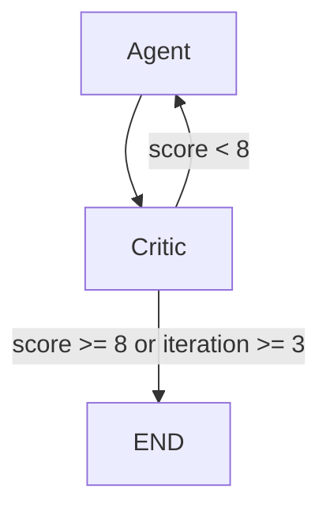
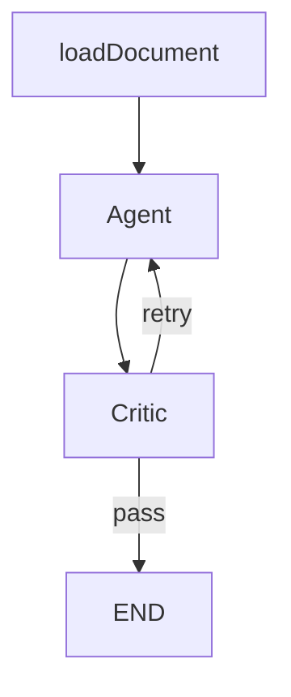
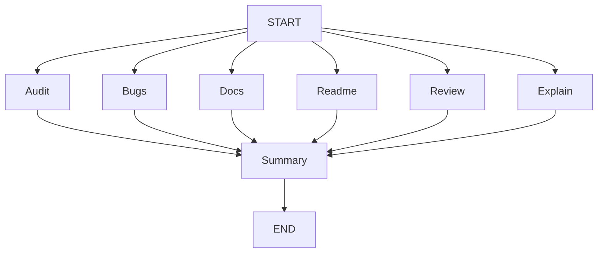
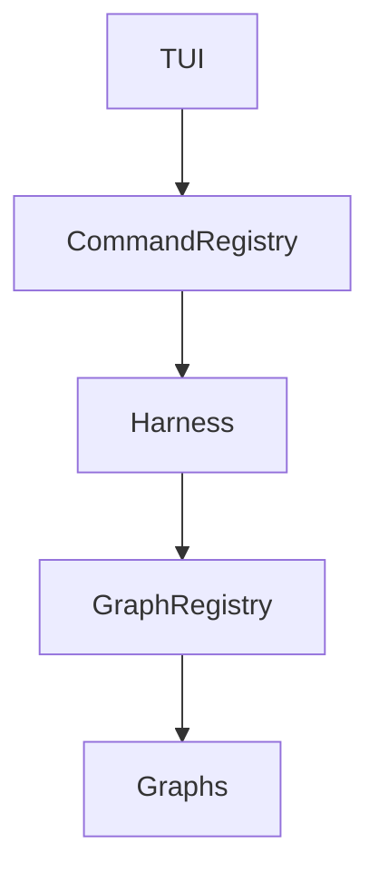
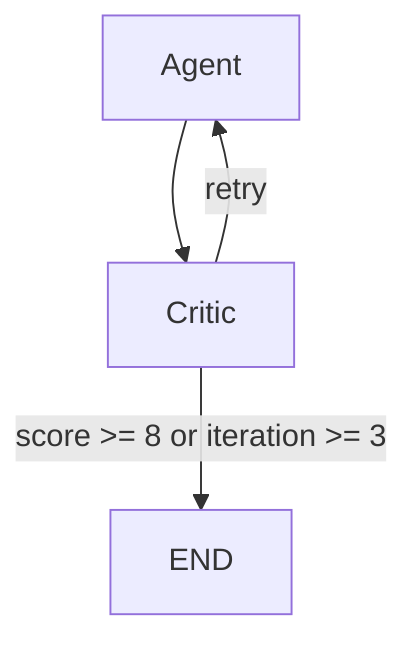
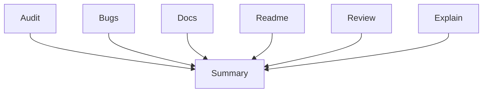

# SOLID-Agent-Harness

[](https://github.com/Dev-Chitrang/SOLID-Agent-Harness/actions/workflows/ci.yml)

A language-agnostic developer tooling platform built with Node.js, LangChain, and LangGraph for repository analysis, documentation generation, and quality workflows.

**What it is not:** SOLID-Agent-Harness is not a chatbot, not an autonomous coding agent, and not a browser-based IDE plugin. It is a structured CLI tool that runs deterministic, graph-based LLM workflows against a local codebase and writes structured outputs to your filesystem or terminal.

---

## Features

### Individual Commands

| Command | Description | Output |
|---|---|---|
| `audit` | SOLID principles audit across the full repository. Covers architectural overview, per-component violations, and refactoring recommendations. | `Review/SOLID_AUDIT.md` |
| `bugs` | Logic and edge-case sweep. Identifies bugs, unsafe patterns, and unhandled parameter ranges. | `Review/BUG_REPORT.md` |
| `docs` | Generates a full architecture reference including module boundaries, data flows, and a Mermaid diagram. | `Review/ARCHITECTURE.md` |
| `readme` | Drafts a production-ready `README.md` based on the actual source layout of the target repository. | `Review/README.md` |
| `review` | Code review for a file or directory. Covers readability, complexity, and refactoring items. | Terminal |
| `explain` | Plain-language breakdown of what a file or module does — useful for onboarding unfamiliar codebases. | Terminal |

### Composite Commands

Composite commands orchestrate multiple individual graphs in parallel. They print a synthesised summary to the terminal after all subgraphs complete. Underlying artifact files are managed by each subgraph independently.

| Command | Graphs run | Output |
|---|---|---|
| `ci-fast` | `audit` + `bugs` | Terminal summary. `SOLID_AUDIT.md` and `BUG_REPORT.md` updated. |
| `quality` | `audit` + `bugs` + `review` | `Review/QUALITY_REPORT.md` (diff-aware write) + terminal summary. |
| `docs-suite` | `docs` + `readme` | Terminal summary. `ARCHITECTURE.md` and `README.md` updated. |
| `onboarding` | `explain` + `docs` + `readme` | Terminal summary. `ARCHITECTURE.md` and `README.md` updated. |
| `full` | All six individual graphs | Terminal summary. All four artifact files updated. |

### Capabilities

- **Provider abstraction** — swap between OpenAI, Anthropic, Gemini, and NVIDIA without changing any graph code.
- **Interactive TUI** — full-screen terminal dashboard for selecting provider, model, command, and target path.
- **Critic loops** — each individual graph runs an Agent → Critic → conditional retry cycle before returning output.
- **Existing-document awareness** — `audit`, `bugs`, `docs`, and `readme` detect whether a report already exists and switch between `generate` and `update` modes automatically.
- **Diff-aware writes** — reports are only written to disk when content has changed.
- **Graph composition** — composite commands invoke individual graph pipelines as subgraphs with parallel fan-out.
- **Shared state** — a common state hierarchy (`BaseState`, `DocumentState`, `CompositeState`) is spread into each graph's `Annotation.Root`.
- **Conditional routing** — critic scores route back to the agent for another iteration or forward to `END`.
- **Registry-driven dispatch** — `graphRegistry` and `commandRegistry` decouple the harness and TUI from individual command implementations. Adding a command requires only a new folder and a registry entry.

---

## Why LangGraph?

V1 and V2 used LangGraph as a thin wrapper. Each graph was essentially:

```
START → Agent → END
```

That topology does not require a graph framework. Any `async/await` call achieves the same result.

V3 introduced workflows where a graph framework earns its place:

**Individual graphs — critic loop with conditional routing:**



The critic node evaluates `analysisResult`, returns a numeric score and feedback, increments an iteration counter, and routes via `addConditionalEdges`. The agent reads `criticFeedback` on the next iteration and incorporates it. This loop is managed entirely by LangGraph's state machine — it cannot be replicated cleanly with plain recursion without rebuilding the same state-passing and routing machinery manually.

**Document-aware graphs — pre-agent state node:**



`loadDocument` reads `config.configurable.targetPath` and `outputDir` to check whether a report file already exists, then sets `existingDocument` and `documentMode` (`generate` or `update`) into state before the agent runs. Every downstream node — including critic iterations — inherits the correct mode through shared state.

**Composite graphs — parallel fan-out with a join point:**



Each branch invokes a complete individual graph pipeline — including its own critic loop — as a subgraph. LangGraph's barrier semantics on `addEdge(['a', 'b', ...], 'summary')` guarantees that `summaryNode` only runs after all parallel branches have settled. The `summaryNode` makes a separate LLM call to synthesise all branch outputs into a single executive report.

These patterns — shared mutable state, conditional routing, subgraph invocation, parallel fan-out with barrier joins — are the scenarios LangGraph was designed for. Using plain `async/await` for the critic loop or composite fan-out would require manually building an equivalent state machine.

---

## Architecture

### Registry Flow



The TUI derives its command list from `Object.keys(commandRegistry)`. Adding a command — a new folder with `agent.js`, `command.js`, `graph.js`, and `prompt.js`, plus two registry entries — is sufficient to make it available in both the CLI and TUI without touching any other file.

### Individual Graph (with critic loop)



`audit`, `bugs`, `docs`, and `readme` additionally prepend a `loadDocument` node before the agent.

### Composite Graph (parallel fan-out)



Each branch is a wrapper node that invokes the full compiled individual graph pipeline, including its critic loop.

### State Hierarchy

```
BaseState
  repositoryFiles, analysisResult, criticFeedback, iteration
  │
  ├── DocumentState  (adds: existingDocument, documentMode)
  │     used by: audit, bugs, docs, readme graphs
  │
  └── CompositeState (adds: auditReport, bugReport, docsReport,
                            readmeReport, reviewResult, explainResult,
                            finalSummary)
        used by: all composite graphs
```

---

## Project Structure

```
solid-agent-harness/
├── bin/
│   └── code-agent.js              # Global executable entrypoint (shebang)
├── src/
│   ├── cli.js                     # Commander.js program — init + TUI launch
│   ├── audit/
│   │   ├── agent.js               # LangGraph node — SOLID audit agent
│   │   ├── command.js             # handleAuditCommand
│   │   ├── graph.js               # StateGraph with critic loop + loadDocument
│   │   └── prompt.js              # generatePrompt + updatePrompt
│   ├── bugs/                      # same structure as audit/
│   ├── docs/                      # same structure as audit/
│   ├── readme/                    # same structure as audit/
│   ├── review/
│   │   ├── agent.js               # LangGraph node — review agent
│   │   ├── command.js             # handleReviewCommand (terminal output)
│   │   ├── graph.js               # StateGraph with critic loop
│   │   └── prompt.js
│   ├── explain/                   # same structure as review/
│   ├── composite/
│   │   ├── ci-fast/               # audit + bugs → summary
│   │   ├── quality/               # audit + bugs + review → QUALITY_REPORT.md
│   │   ├── docs-suite/            # docs + readme → summary
│   │   ├── onboarding/            # explain + docs + readme → summary
│   │   └── full/                  # all six → summary
│   ├── common/
│   │   ├── nodes/
│   │   │   ├── criticNodeFactory.js   # createCriticNode(systemPrompt, scoreKey)
│   │   │   ├── documentStateNode.js   # createDocumentStateNode(fileName)
│   │   │   └── summaryNode.js         # LLM-based synthesis join node
│   │   └── state/
│   │       └── States.js              # BaseState, DocumentState, CompositeState
│   ├── core/
│   │   ├── config.js              # ConfigManager — ~/.code-agent/config.json
│   │   ├── fileSystem.js          # readRepositoryFiles, writeReportFile,
│   │   │                          # writeReportFileDiffAware, readReportFile
│   │   └── harness.js             # AgentHarness.run(command, files, path, outputDir)
│   ├── providers/
│   │   ├── baseProvider.js        # Abstract BaseProvider
│   │   ├── providerFactory.js     # ProviderFactory.create(name, config)
│   │   ├── openai.js
│   │   ├── anthropic.js
│   │   ├── gemini.js
│   │   └── nvidia.js
│   ├── registry/
│   │   ├── commandRegistry.js     # { command: handlerFn, ... }
│   │   └── graphRegistry.js       # { command: compiledPipeline, ... }
│   ├── edit/
│   │   └── command.js             # handleEditCommand — config editor
│   └── ui/
│       └── interactive.js         # Blessed TUI dashboard
├── tests/
│   ├── core/
│   │   ├── config.test.js
│   │   ├── fileSystem.test.js
│   │   └── harness.test.js
│   └── providers/
│       ├── baseProvider.test.js
│       └── providerFactory.test.js
├── Review/                        # Default output directory for generated reports
├── package.json
└── README.md
```

---

## Provider Support

| Provider | Default Model | Notes |
|---|---|---|
| **OpenAI** | `gpt-4o` | Full GPT model family. |
| **Anthropic** | `claude-3-5-sonnet-latest` | Claude 3 and Claude 4 families. |
| **Google Gemini** | `gemini-1.5-pro` | Via `@langchain/google-genai`. Requires a Google AI Studio key. |
| **NVIDIA NIM** | `meta/llama3-70b-instruct` | OpenAI-compatible endpoint at `integrate.api.nvidia.com/v1`. |

Model lists are fetched live from each provider's API when using the TUI. If the fetch fails, a curated fallback list is used automatically.

---

## Installation

**Prerequisites:** Node.js >= 20.17, and an API key for at least one supported provider.

```bash
# Clone the repository
git clone https://github.com/Dev-Chitrang/SOLID-Agent-Harness.git
cd SOLID-Agent-Harness

# Install dependencies
npm install

# Link globally so the code-agent command is available system-wide
npm link
```

To unlink:

```bash
npm unlink -g solid-agent-harness
```

---

## Initialization

Run `init` once to configure your provider credentials:

```bash
code-agent init
```

You will be prompted to select one or more providers and enter an API key for each. Credentials are written to `~/.code-agent/config.json`. The first selected provider becomes the default for CLI runs.

To change the default provider or output directory after initial setup:

```bash
code-agent
# Navigate to the TUI, or run:
# Edit config fields via the built-in edit command accessible from the TUI
```

---

## Screenshots

**Interactive TUI dashboard** — provider, command, and model selection without typing flags:


**Terminal output** — formatted analysis result rendered inline after a command run:


---

## Usage

### Launch the TUI

```bash
code-agent
```

The TUI presents four panels: path input, provider selector, command selector, and model selector. Tab cycles focus. Left/Right changes the selection. Enter runs the command.

```
┌─────────────────── Solid Agent Harness ────────────────────┐
│  ┌─ Path ──────────────────────────────────────────────┐   │
│  │  ./my-project                                       │   │
│  └─────────────────────────────────────────────────────┘   │
└─────────────────────────────────────────────────────────────┘

┌─ Provider ──────┐   ┌─ Command ───────┐   ┌─ Model ─────────────────────┐
│   OPENAI        │   │   audit         │   │   gpt-4o                    │
└─────────────────┘   └─────────────────┘   └─────────────────────────────┘

        [Tab] cycle   [←/→] change   [Enter] run   [Esc] quit
```

### Direct CLI Examples

```bash
# SOLID audit — writes Review/SOLID_AUDIT.md
code-agent audit .

# Bug sweep — writes Review/BUG_REPORT.md
code-agent bugs ./src

# Architecture docs — writes Review/ARCHITECTURE.md
code-agent docs ./my-project

# README generation — writes Review/README.md
code-agent readme ./my-project

# Code review — terminal output
code-agent review ./src/core/harness.js

# Explanation — terminal output
code-agent explain ./src/common/nodes/criticNodeFactory.js

# Quality composite — runs audit + bugs + review, writes QUALITY_REPORT.md
code-agent quality .

# Full composite — runs all six graphs, prints executive summary
code-agent full .
```

All commands accept a path to a file or directory. Reports are written to `Review/` inside the target path by default. The output directory can be changed with the `edit` option in the TUI, which updates `outputDir` in `~/.code-agent/config.json`.

---

## V3 Highlights

V3 restructured every graph and introduced shared infrastructure that V2 lacked:

**Critic loops** — every individual graph runs `Agent → Critic → conditional retry`. The critic scores output on a 1–10 scale and returns structured feedback. The agent incorporates that feedback on the next iteration. Execution exits when score ≥ 8 or after three iterations, whichever comes first. `recursionLimit` is set to 25 to prevent early termination.

**Document awareness** — `audit`, `bugs`, `docs`, and `readme` check for an existing report file before the agent runs. If one exists, the agent receives the current document content and switches to `update` mode, preserving useful content and avoiding full regeneration.

**Diff-aware writes** — the `quality` command and the individual document commands compare new output against existing file content before writing. Identical content is skipped. Only meaningful changes trigger a disk write.

**Graph composition** — composite commands invoke compiled individual graph pipelines as subgraphs. Each subgraph runs its own critic loop independently. A `summaryNode` join point waits for all parallel branches to complete before synthesising a final report.

**Composite workflow separation** — `ci-fast`, `docs-suite`, `onboarding`, and `full` are pure orchestration commands. They print a terminal summary and rely on their underlying graphs to manage artifact files. Only `quality` produces its own distinct artifact (`QUALITY_REPORT.md`).

**Registry-driven architecture** — `graphRegistry` and `commandRegistry` decouple all dispatch logic. The harness does a lookup, not a switch. The TUI derives its command list from `Object.keys(commandRegistry)`. New commands register themselves; no other file needs to change.

**Shared state** — `BaseState`, `DocumentState`, and `CompositeState` are defined once in `src/common/state/States.js` and spread into each graph's `Annotation.Root`. There are no duplicated state field declarations.

---

## Testing

```bash
npm test
```

The test suite uses [Vitest](https://vitest.dev/) and runs against real temporary directories (no mocking of the filesystem for integration-style tests).

Coverage includes:

- `ConfigManager` — load, save, default fallback, case-insensitive provider lookup.
- `readRepositoryFiles` — directory traversal, `.gitignore` respect, extension filtering, single-file mode.
- `writeReportFile` — directory creation, content correctness, nested paths.
- `writeReportFileDiffAware` — skip on identical content (verified via `mtime`), write on changed content, create on first run.
- `readReportFile` — null on missing, correct content on present.
- `AgentHarness` — registry dispatch, `configurable` context (provider, model, targetPath, outputDir), `recursionLimit`, `finalSummary` fallback for composite graphs.
- `BaseProvider` — abstract method enforcement and subclass override.
- `ProviderFactory` — all four providers, case-insensitive matching, custom `defaultModel`, unknown provider error.

---

## Limitations

- Depends on external LLM providers — requires a valid API key and network access.
- Cost and latency vary by provider and model; large repositories will consume more tokens.
- Large repositories may hit context-window limits depending on the model chosen.
- Outputs are recommendations only and should be reviewed by a developer before acting on them.
- Composite commands run multiple LLM workflows sequentially per branch and may take significantly longer than individual commands.

---

## Roadmap

- More provider integrations
- Improved prompt quality and coverage
- Additional report output formats (JSON, HTML)

---

## Contributing

Contributions are welcome.

### Branch strategy

- `main` — stable release branch.
- Feature branches should be created from `main`.

```bash
git checkout main
git checkout -b feature/your-feature-name
```

### Adding a new individual command

1. Create `src/<command>/agent.js`, `command.js`, `graph.js`, `prompt.js`.
2. Follow the critic loop pattern in `graph.js` — import `BaseState` or `DocumentState`, wire `createCriticNode`, add `addConditionalEdges`.
3. Add an entry to `src/registry/graphRegistry.js` and `src/registry/commandRegistry.js`.
4. The harness and TUI pick it up automatically.

### Adding a new composite command

1. Create `src/composite/<command>/graph.js` and `command.js`.
2. Import existing graph pipelines and wire them as wrapper nodes with parallel `addEdge(START, ...)` and a barrier `addEdge([...all nodes], 'summary')`.
3. Add entries to both registries.

### Adding a new provider

1. Extend `BaseProvider` and implement `invoke(messages, model)` and `getModels()`.
2. Add a case to `ProviderFactory.create()`.
3. Add the provider option to the `init` prompt in `src/cli.js`.

### Pull request guidelines

- One feature or fix per PR.
- Run `npm test` before opening.
- If adding a new command, include tests for the command handler and any new `fileSystem` utilities.

---

## License

[MIT](./LICENSE)
