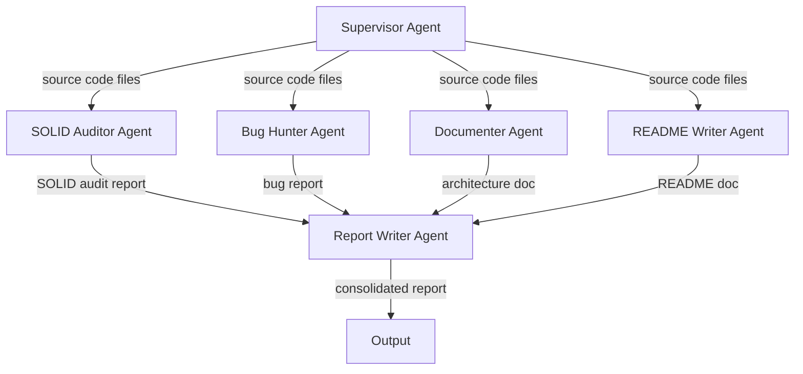
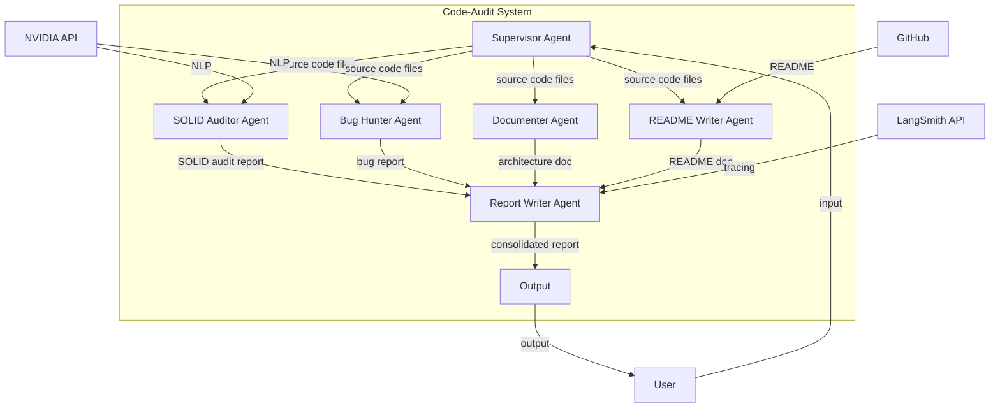

# System Architecture & Technical Docs

**System Overview**

The code-audit system is a multi-agent code analysis and safety testing platform designed to analyze and review codebases. The system consists of several components, including:

*   **Supervisor Agent**: Responsible for compiling file tree paths and providing source code files for analysis.
*   **SOLID Auditor Agent**: Analyzes the codebase for SOLID design patterns and provides a report on the findings.
*   **Bug Hunter Agent**: Tests variable boundaries and hunts for logical bugs in the codebase.
*   **Documenter Agent**: Designs systemic infrastructure documentation for the codebase.
*   **README Writer Agent**: Generates a professional GitHub README.md for the codebase.
*   **Report Writer Agent**: Assembles a consolidated report file markdown bundle for the codebase.

**Module Responsibilities**

*   **Supervisor Agent**:
    *   Compiles file tree paths.
    *   Provides source code files for analysis.
*   **SOLID Auditor Agent**:
    *   Analyzes the codebase for SOLID design patterns.
    *   Provides a report on the findings.
*   **Bug Hunter Agent**:
    *   Tests variable boundaries.
    *   Hunts for logical bugs in the codebase.
*   **Documenter Agent**:
    *   Designs systemic infrastructure documentation for the codebase.
*   **README Writer Agent**:
    *   Generates a professional GitHub README.md for the codebase.
*   **Report Writer Agent**:
    *   Assembles a consolidated report file markdown bundle for the codebase.

**Data Flow Between Modules**

**External Dependencies**

*   **NVIDIA API**: Used for natural language processing and code analysis.
*   **LangSmith API**: Used for code analysis and tracing (optional).
*   **GitHub**: Used for generating README.md files.

**Entry Points**

*   **CLI**: The system can be executed through the command-line interface (CLI) using the `code-audit` command.
*   **API**: The system can be integrated with other applications through its API.

**Component Interactions**

The components interact with each other through the data flow described above. The Supervisor Agent provides source code files to the other agents, which then perform their respective tasks and provide reports to the Report Writer Agent. The Report Writer Agent assembles the reports into a consolidated report file markdown bundle, which is then outputted to the user.

